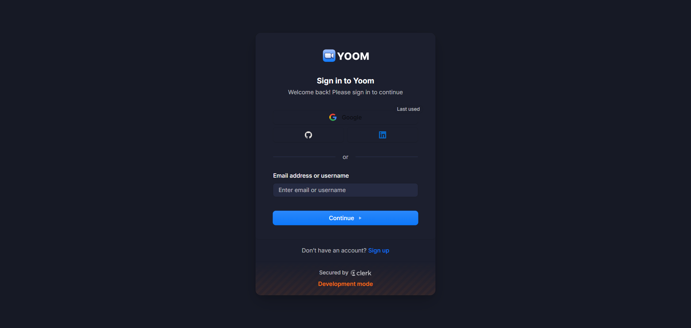
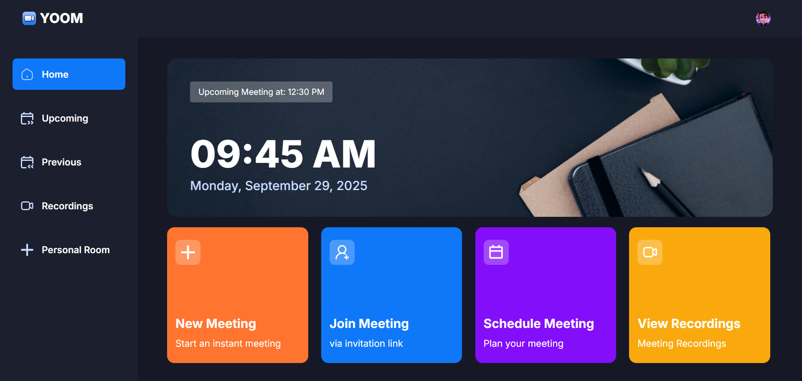
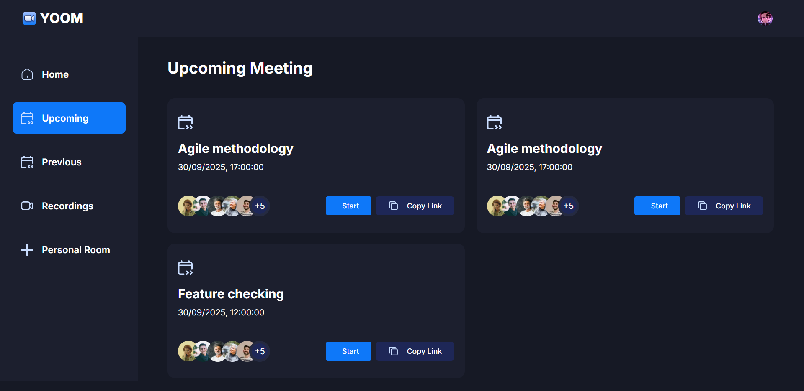
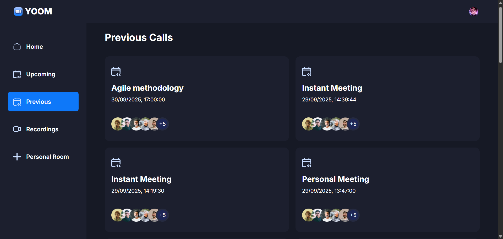
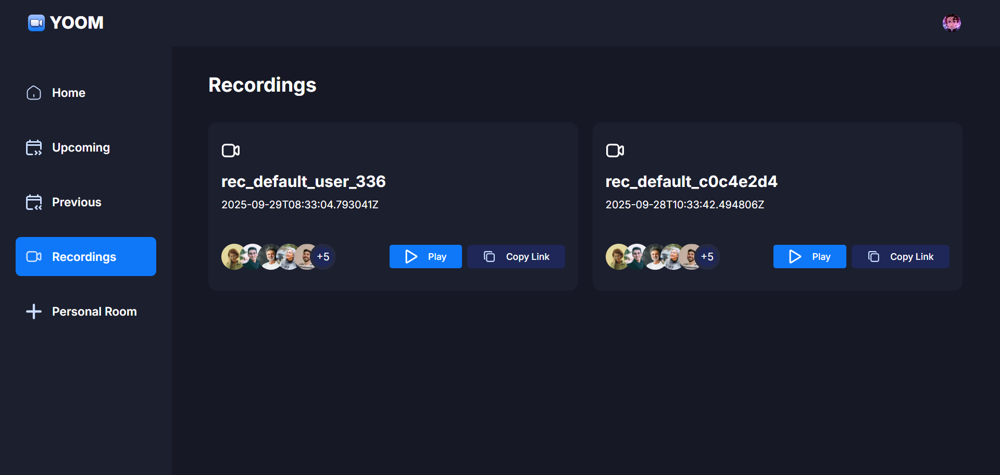
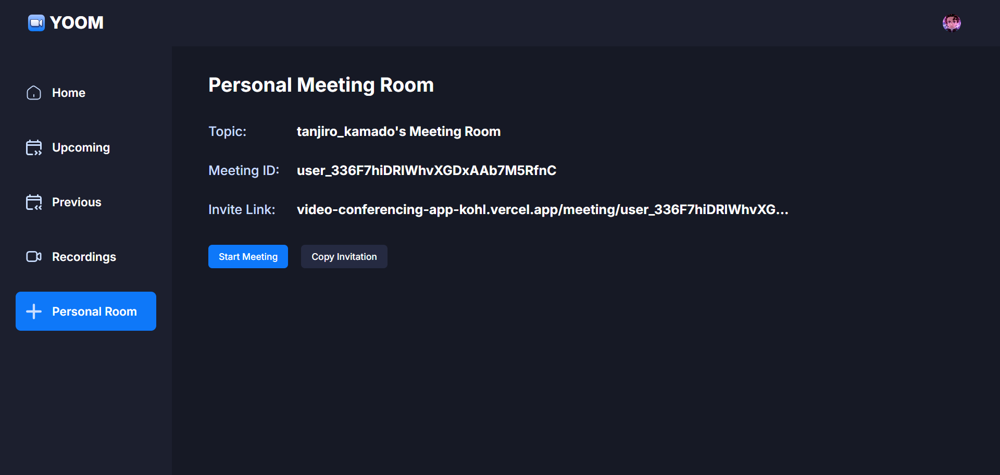

# 🎥 YOOM – Enterprise-Ready Zoom Clone

<p align="center">  
    
    
    
    
    
</p>  

**YOOM** is a **full-stack video conferencing platform** inspired by **Zoom**, built with **Next.js 14, Clerk, and Stream Video SDK**.
It offers **real-time meetings, participant management, scheduling, recordings, and a personal meeting room** — with a sleek UI powered by **Tailwind CSS + ShadCN UI**.

---

## ✨ Features

* 🔑 **Authentication & User Management** – Secure sign-in with Clerk (Google, GitHub, Email).
* ⚡ **Instant Meetings** – Start or join meetings instantly.
* 📅 **Schedule Meetings** – Book meetings with time, date, and description.
* 🎞 **Recordings** – View past meeting recordings.
* 🏠 **Personal Meeting Room** – Permanent private room + shareable link.
* 🎛 **In-Meeting Controls** –

  * Camera & mic toggle
  * Screen sharing
  * Emoji reactions
  * Device selection (mic, camera, speaker)
  * Mute/unmute, pin participants
  * End meeting for all participants
* 🖼 **Dynamic Layouts** – Grid, Speaker Left, Speaker Right.
* 👥 **Participant Sidebar** – Live participant management with statuses.
* 📱 **Responsive UI** – Optimized for both desktop & mobile.
* 🔒 **Secure & Scalable** – Powered by **Stream Video SDK** + Clerk authentication.

---

## 🛠️ Tech Stack

| Category       | Tools Used                                                                    |
| -------------- | ----------------------------------------------------------------------------- |
| **Framework**  | [Next.js 14](https://nextjs.org/)                                             |
| **Styling**    | [Tailwind CSS](https://tailwindcss.com/), [ShadCN UI](https://ui.shadcn.com/) |
| **Auth**       | [Clerk](https://clerk.com/)                                                   |
| **Video SDK**  | [Stream Video](https://getstream.io/video/)                                   |
| **Language**   | TypeScript                                                                    |
| **Deployment** | [Vercel](https://vercel.com/)                                                 |

---

## 📂 Project Structure  

```

YOOM/
┣ .clerk/               # Clerk authentication configs
┣ .next/                # Next.js build output
┣ actions/              # Server actions for API and backend logic
┣ app/                  # Next.js App Router (pages, layouts, routes)
┣ components/           # Reusable UI components
┣ constants/            # Static constants (routes, nav items, etc.)
┣ hooks/                # Custom React hooks
┣ lib/                  # Utility functions & API integrations
┣ node_modules/         # Dependencies
┣ providers/            # Context & providers (Clerk, Stream, Theme, etc.)
┣ public/               # Static assets (images, icons, etc.)
┣ .env.local            # Local environment variables
┣ .gitignore            # Git ignore rules
┣ components.json       # ShadCN UI components config
┣ eslint.config.mjs     # ESLint configuration
┣ middleware.ts         # Middleware for auth & route protection
┣ next-env.d.ts         # Next.js type declarations
┣ next.config.ts        # Next.js configuration
┣ package.json          # Project dependencies & scripts
┣ package-lock.json     # Dependency lockfile
┣ postcss.config.js     # PostCSS configuration
┣ README.md             # Project documentation
┣ tailwind.config.js    # Tailwind CSS configuration
┗ tsconfig.json         # TypeScript configuration

```
---

## ⚙️ Installation & Setup

### 1️⃣ Clone Repository

```bash
git clone https://github.com/Saket22-CS/yoom.git
cd yoom
```

### 2️⃣ Install Dependencies

```bash
npm install
# or
yarn install
```

### 3️⃣ Setup Environment Variables

Create `.env.local` in root:

```env
NEXT_PUBLIC_CLERK_PUBLISHABLE_KEY=your_clerk_publishable_key
CLERK_SECRET_KEY=your_clerk_secret_key

NEXT_PUBLIC_STREAM_API_KEY=your_stream_api_key
STREAM_SECRET_KEY=your_stream_secret_key

NEXT_PUBLIC_BASE_URL=http://localhost:3000
```

### 4️⃣ Start Development Server

```bash
npm run dev
# or
yarn dev
```

➡ Open **[http://localhost:3000](http://localhost:3000)**

---

## 🎯 Core Workflows

### 🔐 Authentication

* Sign in with Google, GitHub, or Email
* Clerk UI customized with **dark theme**

### 🎥 Meetings

* **Start Meeting:** Instant video call with unique ID
* **Schedule Meeting:** Add details + time → auto link generation
* **Join Meeting:** Paste meeting link → enter room

### 🛠 In-Meeting Features

* Preview mic & camera
* Device toggles (mic, camera, speakers)
* Emoji reactions
* Recording support
* Screen sharing
* Switch layouts (Grid, Speaker Left, Speaker Right)
* Live participants sidebar
* Owner can **end meeting for all**

### 🗂 History & Recordings

* Access upcoming, past meetings, and recordings
* Personal meeting room with permanent ID + invite link

---

## 📸 Screenshots  

| Sign In Page | Home Page |
|--------------|-----------|
|  |  |

| Upcoming Page | Previous Page |
|---------------|---------------|
|  |  |

| Recording Page | Personal Room Page |
|----------------|--------------------|
|  |  |


---

## 🚀 Deployment

1. Push repo to GitHub
2. Import in [Vercel](https://vercel.com/)
3. Add environment variables in project settings
4. Deploy 🎉

---

## 📚 Key Learnings

* ✅ Next.js App Router with **layouts & dynamic routes**
* ✅ Balancing **Client vs Server components**
* ✅ Designing **reusable components** with TypeScript
* ✅ Clerk authentication with **custom dark UI**
* ✅ Secure token generation with Next.js **server actions**
* ✅ Real-time video with **Stream Video SDK**
* ✅ Scalable **deployment strategy** with Vercel

---

## 👨‍💻 Author

**Saket Chaudhary**

* 🌐 [LinkedIn](https://linkedin.com/in/saket-chaudhary22)
* 💻 [GitHub](https://github.com/Saket22-CS)

---

## 📜 License

Licensed under the **MIT License**.

---

✨ YOOM is a **production-ready, modern Zoom alternative** built with the latest tech stack, real-time capabilities, and sleek UI design.

---

